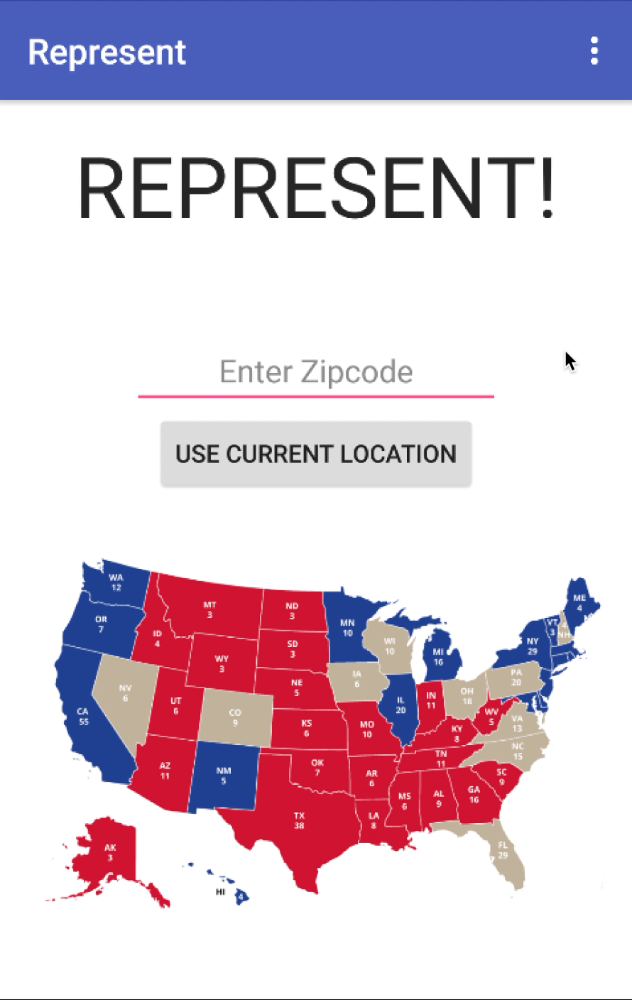
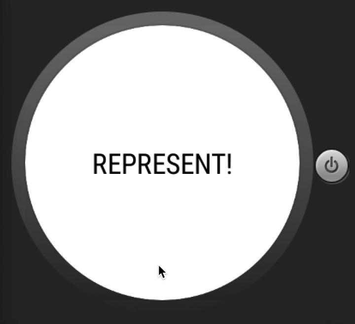
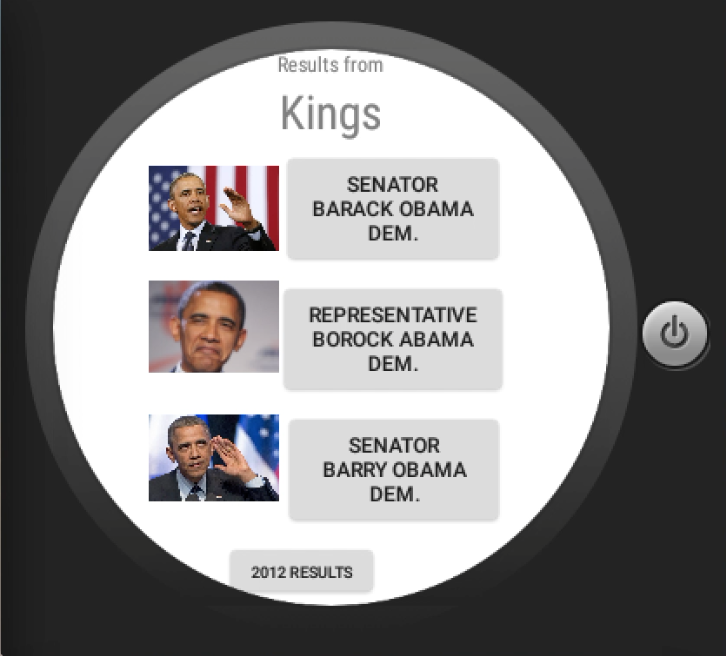
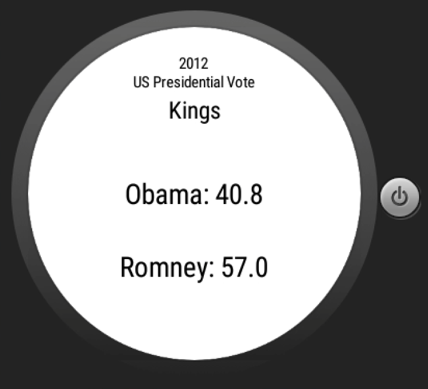

# PROG 02: Represent!

Represent! is an Android Mobile & Wear app that allows users to find the senators and house representatives of any location in the United States.

## Authors

Tait Gu ([taitgu@berkeley.edu](mailto:taitgu@berkeley.edu))

## Demo Video

See [Represent! Video] (https://youtu.be/0rMryU6-MMc)

## Screenshots

## Acknowledgments

* Thank you to the kind users of StackOverflow
